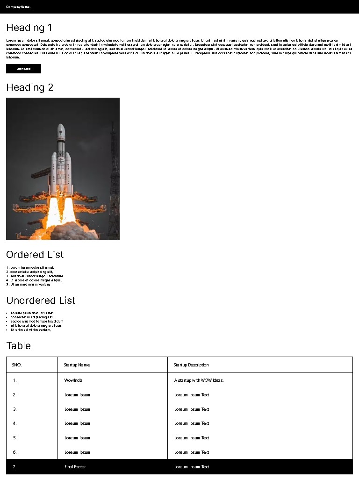

[![Contributors][contributors-shield]][contributors-url]
[![Forks][forks-shield]][forks-url]
[![Stargazers][stars-shield]][stars-url]
[![Issues][issues-shield]][issues-url]
[![LinkedIn][linkedin-shield]][linkedin-url]
 

# My First Web Page Project

This project aims to create a web page with specific elements and styling based on a provided UI design. The web page includes a black navbar, headings, placeholder text, buttons, images, ordered and unordered lists, and a table. The design follows the guidelines outlined in the Figma design.

## Contents

1. [Description](#description)
2. [UI Elements](#ui-elements)
3. [Table](#table)
4. [About Web Page](#about-web-page)
5. [Features](#features)
6. [Built With](#built-with)
7. [Hosting](#hosting)
8. [Instructions](#instructions)
9. [Acknowledgment](#acknowledgment)
10. [Contribution](#contribution)
11. [License](#license)
12. [Contact](#contact)

## Description

The project involves creating a web page with the following features:

1. A black navbar that spans the entire width of the page.
2. A heading placed below the navbar.
3. Placeholder text using the `
` tag placed below the heading.
4. A button wrapped in an `<a>` tag with an `href` attribute linking to "https://www.lipsum.com/".
5. Another heading and an image of choice.
6. An ordered list using the `<ol>` and `<li>` tags.
7. An unordered list using the `<ul>` and `<li>` tags.
8. A table with a table header and footer, following the provided UI design.

## UI Elements

The following UI elements have been implemented:

1. Black navbar spanning the width of the page.
2. Heading placed under the navbar.
3. Placeholder text using the `
` tag.
4. Button wrapped in an `<a>` tag with an `href` attribute.
5. Another heading and an image.

## Table

A table has been created with a table header and footer:

| Header 1 | Header 2 |
|----------|----------|
| Data 1   | Data 2   |
| Data 3   | Data 4   |

Table Footer: (Optional styling)

## About Web Page

  

## Features

1. Black navbar that spans the entire width of the page.
2. Heading placed below the navbar.
3. Placeholder text using the `
` tag.
4. Button wrapped in an `<a>` tag with an `href` attribute.
5. Another heading and an image.
6. Ordered list using the `<ol>` and `<li>` tags.
7. Unordered list using the `<ul>` and `<li>` tags.
8. Table with a table header and footer, following the provided UI design.

## Built With

- HTML
- CSS

## Hosting

The project is hosted on GitHub and can be accessed at [project-link](https://gunjan-dhande.github.io/Accio-July-Contest-1/).

## Instructions

To view the web page locally, follow these steps:

1. Clone the repository: [git clone](https://gunjan-dhande.github.io/Accio-July-Contest-1)
2. Open the `index.html` file in your preferred web browser.

## Acknowledgment

Thanks to [Figma Design](https://www.figma.com/file/Uwvn3RpLiCf0OqEp8BCyTW/Untitled?node-id=1%3A2&t=o6DSCKI5q03CdstG-1) for providing the UI design used as a reference for this project.

## Contribution

Contributions to this project are welcome! If you find any issues or would like to suggest improvements, please feel free to submit a pull request.

## License
This project is released under the `[IntelliJ IDEA 2023.1.1 (Community Edition)]`. See the `LICENSE` file for more information.

## Contact

For any questions or inquiries, please contact [Linkedin](https://www.linkedin.com/in/gunjan-dhande)
 
Project-link : https://gunjan-dhande.github.io/Accio-July-Contest-1/

  

[contributors-shield]: https://img.shields.io/github/contributors/jihedkdiss/jSnake.svg?style=for-the-badge
[contributors-url]: https://github.com/Gunjan-dhande/Accio-July-Contest-1/graphs/contributors
[forks-shield]: https://img.shields.io/github/forks/jihedkdiss/jSnake.svg?style=for-the-badge
[forks-url]: https://github.com/Gunjan-dhande/Accio-July-Contest-1/network/members
[stars-shield]: https://img.shields.io/github/stars/jihedkdiss/jSnake.svg?style=for-the-badge
[stars-url]: https://github.com/Gunjan-dhande/Accio-July-Contest-1/stargazers
[issues-shield]: https://img.shields.io/github/issues/jihedkdiss/jSnake.svg?style=for-the-badge
[issues-url]: https://github.com/Gunjan-dhande/Accio-July-Contest-1/issues
[linkedin-shield]: https://img.shields.io/badge/-LinkedIn-black.svg?style=for-the-badge&logo=linkedin&colorB=555
[linkedin-url]: https://www.linkedin.com/in/gunjan-dhande
